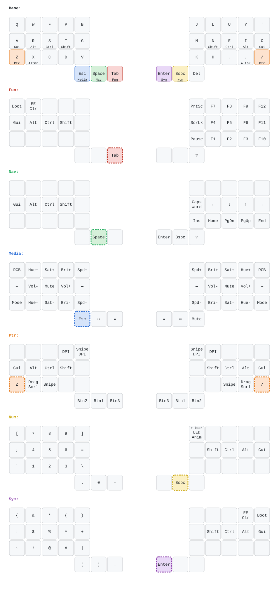
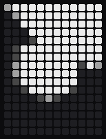
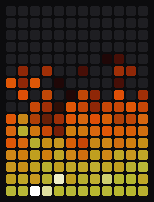

# Dilemma 3x5_3 trackball

## LED matrix

The left half's 12x16 LED matrix runs the
[bk_led_matrix](../../../../../../modules/bastardkb/bk_led_matrix) module.
`LM_ANIM` (NUM layer) cycles through its animations, then these custom ones:

| Bad Apple!! | DOOM fire |
|:-:|:-:|
|  |  |

- **Bad Apple!!** ([badapple.c](badapple.c)): the shadow-art video at 15 fps.
  `tools/led-matrix-sim/badapple.py` makes [badapple_data.h](badapple_data.h) from its frames.
- **DOOM fire** ([doomfire.c](doomfire.c)): the
  [PSX DOOM fire](https://fabiensanglard.net/doom_fire_psx/). Rolling sideways
  blows the flames; rolling up stokes them.

After 10 s without trackball motion the animation fades out and the duck
swims (`LED_MATRIX_MODULE_MOTION_IDLE_MS` in [config.h](config.h)).

`tools/led-matrix-sim/run.py --keymap-docs` regenerates the GIFs.
