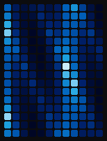
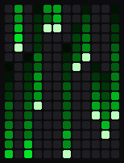
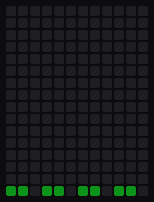
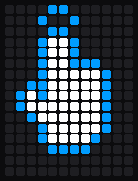
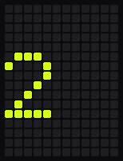
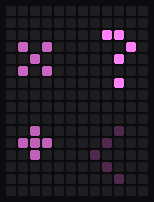

# bk_led_matrix

QMK community module for the 12x16 WS2812 LED matrix on the left half of the
Dilemma (bit-banged on `LED_MATRIX_MODULE_PIN`, RP2040 only). A patched copy of
bstiq's module from [qmk_userspace_bstiq](https://github.com/bstiq/qmk_userspace_bstiq/tree/ledmatrix)
(`b640cd6`); local changes are marked `ykz89:`.

## Animations

`LM_ANIM` (Shift: back) cycles through these and saves the choice. The reactive
ones follow the trackball; all keep running while the ball is still.

| Sparks | Fireworks | Ocean | Asteroids |
|:-:|:-:|:-:|:-:|
|  |  |  |  |

| Matrix | Tetris | Bad Apple!! |
|:-:|:-:|:-:|
|  |  |  |

More styles (wave, chevron, comet, stars, ball, warp, fireflies, sand, water,
car) are built in; `LED_MATRIX_MODULE_MOTION_CYCLE` picks which ones the key
cycles through.

## Layer animations

Shown while a layer is held. The keymap picks one per layer with
`bklm_layer_anim_user()`; layers without one show the layer stack.

| Gear | Nav arrow | Equaliser | Hand | Digit | Math |
|:-:|:-:|:-:|:-:|:-:|:-:|
|  |  |  |  |  |  |

## Setup

```c
// config.h
#define LED_MATRIX_MODULE_PIN GP12
```
```json
// keymap.json
{ "modules": ["bastardkb/bk_pointing_device", "bastardkb/argos", "ykz89/bk_led_matrix"] }
```

Settings are in `post_config.h`. Pointer mode, activity and the chosen animation
are synced from the USB half, so it works with either half connected.

## Previewing

`tools/led-matrix-sim/run.py` runs this module's drawing code on the host and
renders GIFs; `run.py --docs` regenerates the ones above. Bad Apple's frames come
from `tools/led-matrix-sim/badapple.py`.
